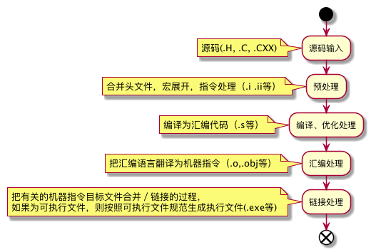

# C语言
做为老程序员，这里就不谈论语言本身的语法及规范了，主要从语言本身设计原理（编译等）、工程化等方面进行学习总结。
相对于高级语言的优势跨平台这点来说，是C类程序的一大痛点。比如有如下几个概念，读者你能区分清楚么？
GNU C 、ANSI C, ISO C and Standard C 、`C++`。GNU C 为技术狂人 Stallman 提出来的标准，ANSI C 为 American National Standards Institute (ANSI) 制定的 C 标准，此标准被 International Organization for Standardization (ISO) 国际标准协会接收后，也就变成的 ISO C，最终其演变为国际公认的 C 标准，也就是 standard C。 `C++` 则为 C 的扩展，使其具备高级语言的特性。不同语言的版本最终由 ansi C 来标准化了，但是 C 的编译器则是由各自的平台去实现的，比如 linux、 unix、window 等等，都有自己的编译器，而标准对编译器的规范并没有那么严，导致某一平台开发的程序不能在所有的平台运行，甚至还不能在其它平台编译。


## 程序构成

C／C++ 语言一般由两部分组成：.H 头文件 和 .C 或 .CXX 源文件，头文件用于定义公共的内容，在规范中，头文件不能包含程序的入口函数，也就是 main 函数，而源文件可以。但是源码并不强制使用以上扩展名定义，一般为了可读性都会按照以上规则进行定义。
使用公共代码内容的方式由 #include 指令完成包含，其逻辑为把该行替换为指定文件的内容。分为两种：
* `#include <stdio.h>`

   这种为在特定位置查找共享代码，一般为 `C／C++` 的标准库存放位置。可以参考 C99 C11 查看标准库头文件列表
* `#include "文件名"`

   这种为在源文件所在目录查找共享代码，如果查找不到，则在标准库存放位置查找。

这里为共享代码，按照 `C／C++` 规范，include 的可以是头文件，也可以是源文件，但是在 C 语言中，不建议使用源文件，这会导致很多问题。 `C++` 由于其高级特性，可以使用。`C++` 由于引入了命名空间，从 C98 开始，标准库的头文件默认使用不带后缀的名称引入，需要按照以下用法来使用

```C++
#include <iostream>
using namespace std;
int main()
{
  cout << "Hello World!";
}
```

or

```C++
#include <iostream>
int main()
{
  std::cout << "Hello World!";
}
```
当然为了兼容旧的编译器及版本，也支持传统的方式
```C++
#include <iostream.h>
int main()
{
  cout << "Hello World!";
}
```

## 编译过程



C 类编译器进行编译时基本都按照图中的几步来完成
* 1、预处理(Preprocessing)
   预处理过程包含以下工作，处理完成后会生成 `.i` 等扩展名文件
   * 宏展开
   * 编译指令处理
   * 包含文件处理
   * 删除注释
   * 添加行号以及文件标识

* 2、编译、优化处理(Compilation)
   
   编译、优化处理就是编译原理的范畴，把预处理过的文件进行一系列的词法分析、语法分析、语义分析、代码优化处理后，生成汇编代码。汇编代码文件以 `.s`扩展名文件。

* 3、汇编处理(Assembly)

   汇编处理就是将上一步编译的汇编代码转换为机器可以执行的指令。每条汇编代码都会转换为一条机器指令。并最终生成 `.o` 为扩展名的机器指令代码文件。

* 4、链接处理(Linking)
   
    `C` 程序是以文件为单元，如果程序规模超过一个文件，也就是多个文件之间有关联，那么链接处理就会把多个编译生成的 `.o` 文件合并为一个文件。另外 `C` 也允许引用编译好的库，也就是 lib，此时会分为静态链接和动态链接两种情况。
    * 静态链接

        在编译阶段直接把静态库加入到可执行文件中去，这样可执行文件 size 会比较大
    * 动态链接
       
        在链接阶段仅加入描述类信息，在程序执行时根据描述信息找到库加载到内存使用。

## make

学习完基于理论后，我们要开始一个项目，项目的规模肯定不止一两个源码文件，这样不太好维护，也不太好组织。在源文件、共享库太多后，编译一个项目起来就很有难度了。当然这里除开 window VS 的用户，因为 IDE 已经帮你把这些工作都固化下来了，开发者只需要在界面点点点即可。
make 就是一个工具，它按照 `C` 的编译规则和工程实践经验定义了一套工具和规则,它起始于1976年的贝尔实验室，由 `Stuart Feldman` 创建,是一个比较古老的工具。一个工程中的源文件不计其数，并且按类型、功能、模块分别放在若干个目录中，make 定义了一系列的规则来指定，哪些文件需要先编译，哪些文件需要后编译，哪些文件需要重新编译，甚至于进行更复杂的功能操作，一般使用一个名称 `Makefile` 文件定义这些规则。本章节只做基本介绍，详细可以参考后面的地址学习

### 规则的语法

```makefile
targets : prerequisites
  command
  ...
```

targets 是文件名，以空格分开，可以使用通配符。一般来说，我们的目标基本上是一个文件，但也有可能是多个文件。
command 是命令行，如果其不与 “targets:prerequisites” 在一行，那么，必须以[ Tab 键]开头，如果和 prerequisites 在一行，那么可以用分号做为分隔。（见上）prerequisites 也就是目标所依赖的文件（或依赖目标）。如果其中的某个文件要比目标文件要新，那么，目标就被认为是“过时的”，被认为是需要重生成的。这个在前面已经讲过了。如果命令太长，你可以使用反斜框（‘\’）作为换行符。 make 对一行上有多少个字符没有限制。规则告诉make两件事，文件的依赖关系和如何生成目标文件。
一般来说，make 会以 UNIX 的标准 Shell ，也就是 `/bin/sh` 来执行命令。


### 编写命令

每条规则下面都有若干个命令，此命令跟操作系统的 shell 命令一致，每条命令必须以 [TAB] 键开头，除非命令紧跟在规则后面的分号之后。在命令行之间中的空格或是空行会被忽略，但是如果该空格或空行是以 [Tab] 键开头的，那么 make 会认为其是一个空命令。如果命令以 `@` 开头，那么执行的时候，这个命令行不会被显示出来，只会显示执行的效果。如果你要连续执行命令，使其有连续性，则必须把关联的命令写在一行，并以分号 `;` 分隔开。每条命令的执行都会以 makefile 所在的目录为基准，调用 shell 执行。

### 使用变量

在 Makefile 中可以定义变量，与 shell 类似，变量名可以包含字符、数字、下划线，但不能包含有 `:` 、 `#` 、 `=` 或 空白字符。变量引用与 shell 类似，使用 `$`和变量名来引用变量，比如  `$(name)` or `${name}` 都是引用定义为 name 的变量。变量可以在许多地方使用，目标、规则、命令等都可以使用。

### 使用条件判断

在 Makefile 中可以根据不同条件来选择不同的分支编译情况，典型的比如平台不一样，编译器不一样。比如我们写了程序需要在 linux 和 mac 上编译运行，使用统一的 Makefile 那么我们只需要把编译器定义为变量即可，然后根据不同平台预设编译器的名称。如果 CC 编译器为 gcc ，则使用 gcc 的 lib 库，否则使用通用的 lib 库。这里变量 CC 为隐含规则的变量，代表 C 语言编译器不需要定义，默认值为 cc。

```makefile
libs_for_gcc = -lgnu
normal_libs =

foo: $(objects)
ifeq ($(CC),gcc)
        $(CC) -o foo $(objects) $(libs_for_gcc)
else
        $(CC) -o foo $(objects) $(normal_libs)
endif
```

### 使用函数
在 Makefile 中可以使用函数来处理变量，从而让我们的命令或是规则更为的灵活和具有智能。make所支持的函数也不算很多，不过已经足够我们的操作了。函数调用后，函数的返回值可以当做变量来使用。
函数的调用与变量类似，也是以 `$` 开头，`$(function arguments)` or `${function arguments}` 都为调用 function 函数。具体有哪些函数参考后面的链接学习。
总共分为以下几类：
  * 字符串处理函数
  * 文件名操作函数
  * foreach 函数
  * if 函数
  * call 函数
  * origin函数
  * shell函数
  * 控制make的函数

### make 运行
一般来说，直接在 Makefile 所在的目录运行 make 命令即可运行make，跟shell类似，其执行结果会返回三个退出码。
```
0 —— 表示成功执行。
1 —— 如果make运行时出现任何错误，其返回1。
2 —— 如果你使用了make的“-q”选项，并且make使得一些目标不需要更新，那么返回2。
```

我们也可以通过参数指定 make 文件，比如 `make -f fmake.mk`,在运行时，一般make 会找到 Makefile 文件中的第一个目标做为默认目标进行执行，也可以通过参数指定执行的目标，比如 `make build` 仅执行 build 目标。

### 总结归纳
我们以 《C 程序设计语言》第二版里面的计算器为例来对 C 和 makefile 进行归纳总结。

按照 4.5 章节 头文件 的内容我们把计算器分为以下几个文件

* calc.h  //公共部分
* man.c   //主函数
* getop.c  //运算符获取操作
* stack.c  // 计算栈相关的逻辑
* getch.c  //获取字符的逻辑


如果按照以上分模块组织后的工程，我们手动编译起来就比较的麻烦，虽说只有5个文件，但是设想下，如果我们的项目规模为成千上万的文件呢？
使用 makefile 对其进行构建如何编写？代码参考 ,这里我直接给出最优的 makefile 版本来进行解释。

```makefile
SRCS = $(wildcard *.c)
OBJS =$(patsubst %.c,%.o,$(SRCS))
TARGET = calc
.PHONY: clean all post-install pre-install
OUTPUT = build

all : pre-install $(TARGET) post-install

$(TARGET) : $(OBJS)
	$(CC) -o $@ $^

%.o : %.c
	$(CC) $< -c -o $@ 

pre-install : 
	@if [ ! -d ${OUTPUT} ]; \
            then  mkdir ${OUTPUT}; \
    fi;
post-install :
	mv $(TARGET) $(OBJS) $(OUTPUT)
clean :
	rm -rf $(OUTPUT)

```

### 后记
如果项目规模变大后，还要手动去写这个 makefile 的话，特别是针对不同平台，比如 `gnu make` 、`BSD make` 、 `Microsoft make` 、`QT make` 等有自己的规范，如果你开发的软件属于跨平台的，那么在面对构建这块就会变得非常痛苦 ，也是一件非常有挑战的事情，所以出现了 autoconf 和 automake 这种工具，目前大部分 *unix 平台的软件编译方式还都延续了这种工具的使用。这里就不多介绍了，有兴趣的自己去学习。此文会接下来会介绍比它们更先进的工具 `CMAKE`。

## CMAKE
CMake 是一个跨平台的自动化建构系统,它使用一个名为 CMakeLists.txt 的文件来描述构建过程,可以产生标准的构建文件,如 Unix 的 Makefile 或 Windows Visual C++ 的 projects/workspaces 。文件 CMakeLists.txt 需要手工编写,也可以通过编写脚本进行半自动的生成。CMake 提供了比 autoconfig 更简洁的语法。 它由 2000 年的 `Kitware` 公司的 [VTK](https://en.wikipedia.org/wiki/VTK) 逐步发展而来。工具集包含 `cmake` 、 `cpack` 、 `ctest` 三个。

CMake 跟 make 类似使用抽象的方式定义编译过程，它把 make 构建过程抽象后使用一种通用语言进行描述，然后使用工具对其解析并生成目标平台的 makefile 文件，接着后面的工作就交给目标平台的编译器进行编译。由一系列抽象的规则来定义工程的构建，它由一个叫 CMakeList.txt 的来定义这个规则，如果工程模块较多，则每个子目录都必须有这个文件来定义这个目标的编译规则。另外 CMake 利用其 宏 的特性，定义了很多公共的宏工具函数，可以方便复用，一般在 cmake 的安装根目录下的 Modules 目录中。

### CMAKE 构建系统

基于CMake的构建系统以高级别的逻辑目标组为单元来进行组织。每个目标对应于一个可执行文件或库，或是包含自定义命令的目标（比如shell、python等）。构建系统有定义目标之间的依赖关系的规则，用于确定构建的顺序和响应改变的更新规则。
CMake 所有的目标都被定义为命令 `command` 函数形式, 类似于 make 规则的函数，在 CMakeList.txt 文件中只需要编写这些 `command` 即可。在 CMake 3.7版本中，已有 88 个 `command`. 包含 项目定义、 编译目标定义、依赖关系定义、逻辑函数控制等等。下面仅做功能性的简单入门介绍，详细请参考官方文档。

#### 项目定义

一个最小化的 CMake 项目定义文件必须包含以下几项,其它都是辅助生成 makefile 规则命令。

```cmake
# CMake 最低版本号要求
cmake_minimum_required (VERSION 2.8)
# 项目信息
project (Demo1)
# 指定生成目标
add_executable(Demo main.cc)
```

#### 一个完成的构建文件

此处以 cmake 官方的学习例子来进行介绍一个完整的 CMakeList.txt 文件

```cmake
# cmake 的最小版本
cmake_minimum_required (VERSION 2.6)
#工程名称
project (Tutorial)

# 设置变量
set (Tutorial_VERSION_MAJOR 1)
set (Tutorial_VERSION_MINOR 0)

# 包含的cmake提供的函数检查模块，检查函数是否可用。使用宏编写的，可以参考宏的命令
include (${CMAKE_ROOT}/Modules/CheckFunctionExists.cmake)
check_function_exists (log HAVE_LOG)
check_function_exists (exp HAVE_EXP)

# 设置用户的选项
option(USE_MYMATH "Use tutorial provided math implementation" ON)
# 动态配置文件，从 cmake 的环境变量做类似宏的替换，来修改目标文件
configure_file (
  "${PROJECT_SOURCE_DIR}/TutorialConfig.h.in"
  "${PROJECT_BINARY_DIR}/TutorialConfig.h"
  )

# 把 cmake 的编译目标路径加入到 include 的文件列表中，方便查找本项目的头文件
include_directories ("${PROJECT_BINARY_DIR}")
# 条件判断，根据用户的 option 决定是否使用自定义的数学函数，而不是使用系统的数学函数，里面有加入模块的案例 add_subdirectory
if (USE_MYMATH)
  include_directories ("${PROJECT_SOURCE_DIR}/MathFunctions")
  add_subdirectory (MathFunctions)
  set (EXTRA_LIBS ${EXTRA_LIBS} MathFunctions)
endif ()

# 添加二进制目标
add_executable (Tutorial tutorial.cxx)
target_link_libraries (Tutorial  ${EXTRA_LIBS})
# 添加安装目标，参考 install 的 command， 一个是编译目标的安装，一个是文件的安装
install (TARGETS Tutorial DESTINATION bin)
install (FILES "${PROJECT_BINARY_DIR}/TutorialConfig.h"
  DESTINATION include)
# 启用测试
enable_testing ()
# 添加功能测试案例
add_test (TutorialRuns Tutorial 25)
# 添加使用说明测试案例
add_test (TutorialUsage Tutorial)
# 检查测试结果，使用正则表达式匹配输出内容，如果匹配则说明运行通过
set_tests_properties (TutorialUsage
  PROPERTIES
  PASS_REGULAR_EXPRESSION "Usage:.*number"
  )
#定义一个宏来抽象测试案例的添加和验证方法，方便复用
macro (do_test arg result)
  add_test (TutorialComp${arg} Tutorial ${arg})
  set_tests_properties (TutorialComp${arg}
    PROPERTIES PASS_REGULAR_EXPRESSION ${result}
    )
endmacro ()

# 使用宏来设置测试案例和结果验证
do_test (4 "4 is 2")
do_test (9 "9 is 3")
do_test (5 "5 is 2.236")
do_test (7 "7 is 2.645")
do_test (25 "25 is 5")
do_test (-25 "-25 is 0")
do_test (0.0001 "0.0001 is 0.01")

# 编译 CPack 驱动的安装包
include (InstallRequiredSystemLibraries)
set (CPACK_RESOURCE_FILE_LICENSE "${CMAKE_CURRENT_SOURCE_DIR}/License.txt")
set (CPACK_PACKAGE_VERSION_MAJOR "${Tutorial_VERSION_MAJOR}")
set (CPACK_PACKAGE_VERSION_MINOR "${Tutorial_VERSION_MINOR}")
set (CPACK_PACKAGE_CONTACT       "foo@bar.org")
# 启动并包含 CPack 模块
include (CPack)

# 启用并包含 CTest 模块
include (CTest)
```

#### 二进制目标

可执行文件和库使用  `add_executable`  和  `add_library` 命令定义。
生成的二进制文件具有针对平台的适当前缀，后缀和扩展名。二进制目标间的依赖关系使用`target_link_libraries` 命令：如下代码

```cmake
add_library(archive archive.cpp zip.cpp lzma.cpp)
add_executable(zipapp zipapp.cpp)
target_link_libraries(zipapp archive)

```

`archive` 被定义为一个静态库，通过从 archive.cpp，zip.cpp 和 lzma.cpp 文件编译所得。 zipapp 被定义为通过编译 zipapp.cpp 和链接形成的可执行文件。链接 zipapp 可执行文件时，archive 静态库作为依赖项被链接。

##### 二进制可执行目标

从以上例子我们知道 CMake 定义二进制可执行目标时使用 `add_executable()` 命令，比如以下例子

```cmake
add_executable(mytool mytool.cpp)
```

##### 二进制类库类型

从以上例子我们知道 CMake 定义二进制可执行目标时使用 `add_library()` 命令，比如以下例子

```cmake
add_library(archive SHARED archive.cpp zip.cpp lzma.cpp)
add_library(archive STATIC archive.cpp zip.cpp lzma.cpp)
add_library(archive MODULE 7z.cpp)
```

STATIC，SHARED 或者 MODULE 可以给出以指定要创建的库的类型。 STATIC 库是链接其他目标时使用的对象文件的归档。 SHARED 库在运行时动态链接并加载。 MODULE 库是不连接到其他目标的插件，但可以使用类似 dlopen 的功能在运行时动态加载。如果没有明确给出类型，则该类型是 STATIC 或 SHARED 基于变量的当前值BUILD_SHARED_LIBS 是 ON.

#### 多个目录

参见完成例子里面使用 `add_subdirectory()` 把多个子模块包含进编译过程


## 参考
- https://en.wikipedia.org/wiki/ANSI_C
- https://en.wikipedia.org/wiki/C%2B%2B
- https://en.wikipedia.org/wiki/Compatibility_of_C_and_C%2B%2B
- https://en.wikibooks.org/wiki/C_Programming/Compiling
- https://cs.nju.edu.cn/gchen/teaching/np/kernighan-ritchie/kandr.html
- http://users.cs.cf.ac.uk/Dave.Marshall/C/node3.html
- http://www.cprogramming.com/
- http://www.cplusplus.com/
- https://en.wikipedia.org/wiki/Comparison_of_executable_file_formats
- http://www.developingthefuture.net/c-structs-vs-c-sharp-structs-vs-c-plus-plus-structs/

- https://www.gnu.org/software/make/manual/make.html
- https://en.wikipedia.org/wiki/Make_(software)
- http://wiki.ubuntu.com.cn/%E8%B7%9F%E6%88%91%E4%B8%80%E8%B5%B7%E5%86%99Makefile

- https://cmake.org/